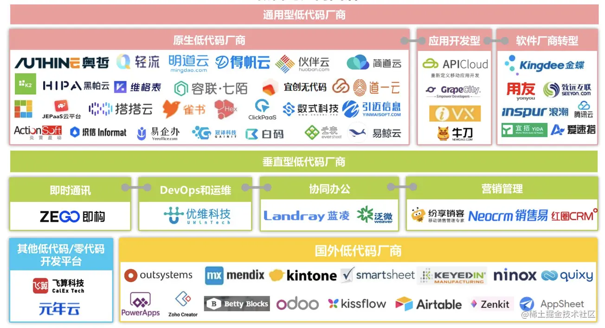
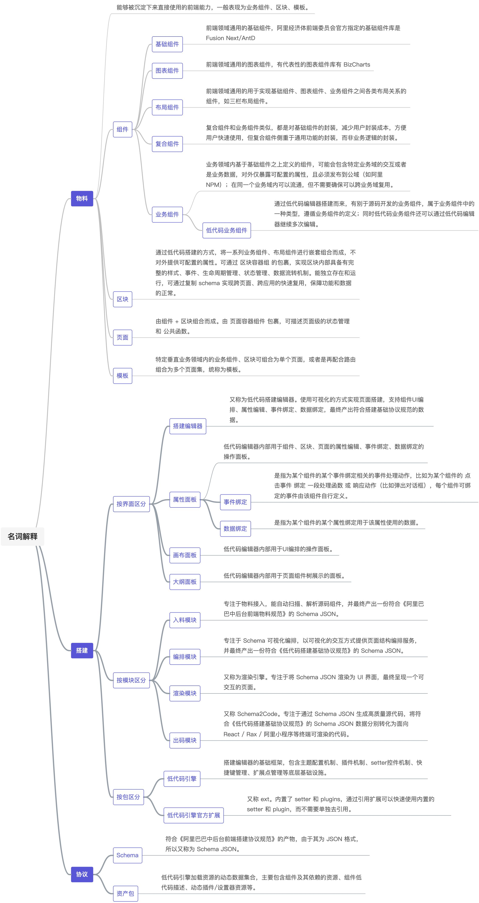

# 低代码

## 低代码厂商

材料来源于iRearch

零代码、低代码的概念在整个全球行业内已经流行了很长一段时间。通常意义上的低代码定义会有三个关键点：

- 一个用于生产软件的可视化编辑器
- 中间包含了一些用于组装的物料，可以通过编排、组合和配置它们以生成丰富的功能或表现
- 最后的实施结果是成本降低

通常情况下低代码平台会具备以下的几个能力：

- 可视化页面搭建，通过简单的拖拽完成应用页面开发，对前端技能没有要求或不需要特别专业的了解；
- 可视化模型设计，与业务相关的数据存储变得更容易理解，甚至大多数简单场景可以做到表单即模型，模型字段的类型更加业务化；
- 可视化流程设计，不管是业务流程还是审批流程，都可以通过简单的点线连接来进行配置；
- 可视化报表及数据分析，BI数据分析能力成为标配，随时随地通过拖拽选择来定义自定义分析报表；
- 可视化服务与数据开放、集成，具备与其他系统互联互通的配置；
- 权限、角色设置标准化和业务化，通过策略规则配置来将数据、操作的权限进行精细化管理；
- 无需关心服务器、数据库等底层运维、计算设施设备、网络等等复杂技术概念，具备安全、性能的统一解决方案，开发者只需要专注于业务本身；

名词解释 - LowCode Engine

## 页面搭建

低代码不仅仅包括 “能写代码”，主要具备如下四个特性：物料接入、编排能力、渲染能力、出码能力。

### 物料接入

#### 表单设计

### 编排能力

#### 流程设计

- [LogicFlow](https://github.com/didi/LogicFlow)
- [BPMN](https://bpmn.io/toolkit/bpmn-js/)
- [vue-flow](https://github.com/bcakmakoglu/vue-flow) - Flowchart

### 渲染能力

### 出码能力

## 参考资料

- [简道云](https://www.jiandaoyun.com/)
- [LowCode Engine](https://lowcode-engine.cn/)
